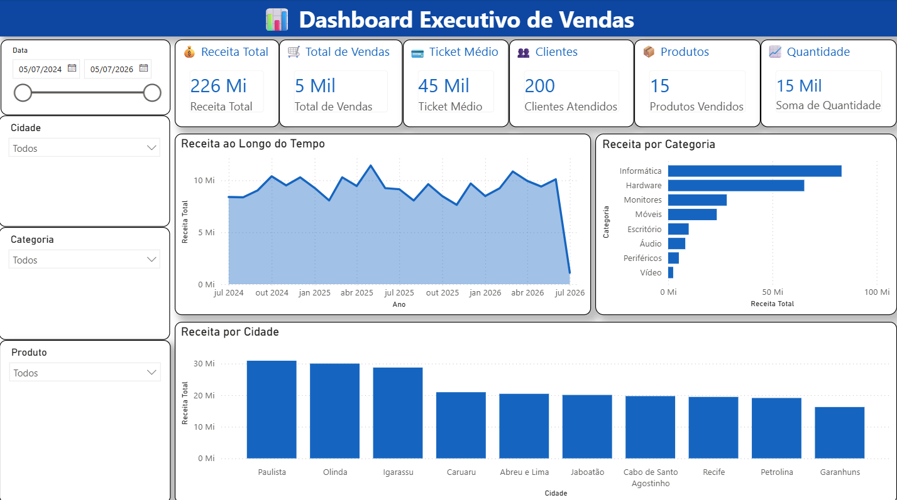

# 📊 Pipeline ETL com Python, Docker e Power BI

<p align="center">


</p>

---

## 📌 Sobre o Projeto

Este projeto simula um processo completo de **ETL (Extract, Transform and Load)** utilizando Python.

Os dados são gerados automaticamente, passam por validações, transformações e são armazenados em um banco SQLite. Em seguida, são utilizados para criação de dashboards profissionais no **Power BI**, permitindo análises comerciais e gerenciais.

O projeto foi desenvolvido com foco em demonstrar conhecimentos de Engenharia de Dados, Análise de Dados e Business Intelligence.

---

# 🎯 Objetivos

- Automatizar um pipeline ETL
- Gerar dados fictícios realistas
- Validar e transformar informações
- Armazenar dados em banco SQLite
- Gerar relatórios em Excel
- Construir dashboards profissionais no Power BI
- Containerizar a aplicação com Docker

---

# 🛠 Tecnologias Utilizadas

- Python 3.11
- Pandas
- Faker
- SQLite
- OpenPyXL
- XlsxWriter
- Docker
- Git
- GitHub
- Power BI

---

# 📂 Estrutura do Projeto

```text
Pipeline-ETL-Python
│
├── banco/
│   └── vendas.db
│
├── dashboard/
│   ├── Dashboard_ETL.pbix
│   ├── dashboard_visao_geral.png
│   ├── dashboard_clientes.png
│   ├── dashboard_produtos.png
│   └── dashboard_tendencias.png
│
├── dados/
│   ├── clientes.xlsx
│   ├── produtos.csv
│   └── vendas.csv
│
├── logs/
│   └── pipeline.log
│
├── relatorios/
│   ├── relatorio.xlsx
│   └── resumo.csv
│
├── scripts/
│
├── config.py
├── main.py
├── Dockerfile
├── requirements.txt
├── README.md
└── .gitignore
```

---

# 🔄 Fluxo do Pipeline

```text
Geração dos Dados
        │
        ▼
Extração
        │
        ▼
Validação
        │
        ▼
Transformação
        │
        ▼
Carga no SQLite
        │
        ▼
Relatórios Excel
        │
        ▼
Dashboard Power BI
```

---

# 🚀 Como executar

## Clone o projeto

```bash
git clone https://github.com/SEU-USUARIO/Pipeline-ETL-Python.git
```

```bash
cd Pipeline-ETL-Python
```

---

## Instale as dependências

```bash
pip install -r requirements.txt
```

---

## Execute

```bash
python main.py
```

---

# 🐳 Executando com Docker

## Build

```bash
docker build -t etl-python .
```

## Run

```bash
docker run --rm -v ${PWD}:/app etl-python
```

---

# 📈 Dashboard Power BI

O projeto possui um dashboard executivo dividido em quatro páginas.

## 📊 Visão Geral

- Receita Total
- Ticket Médio
- Produtos Vendidos
- Clientes Atendidos
- Receita por Categoria
- Receita por Cidade
- Evolução das Vendas



---

## 👥 Clientes

- Top 10 Clientes
- Receita por Cidade
- Ticket Médio por Cidade


---

## 📦 Produtos

- Top 10 Produtos
- Receita por Categoria
- Quantidade Vendida por Categoria


---

## 📈 Tendências

- Evolução Mensal
- Receita Acumulada
- Crescimento das Vendas


---

# 📊 Indicadores

O dashboard apresenta indicadores como:

- Receita Total
- Ticket Médio
- Total de Vendas
- Produtos Vendidos
- Quantidade Vendida
- Clientes Atendidos
- Receita por Categoria
- Receita por Cidade
- Top Clientes
- Top Produtos

---

# 💡 Principais funcionalidades

✔ Geração automática de dados

✔ ETL completo

✔ Banco SQLite

✔ Relatórios Excel

✔ Dashboard Power BI

✔ Docker

✔ Estrutura organizada

✔ Projeto para portfólio

---

# 📸 Demonstração

> Dashboard Executivo


---

# 📄 Licença

Este projeto foi desenvolvido para fins educacionais e de portfólio.

---

# 👨‍💻 Autor

**Pablo Riquelme**

GitHub: https://github.com/riquelmexs

LinkedIn: https://www.linkedin.com/in/pablo-riquelme-ss/
